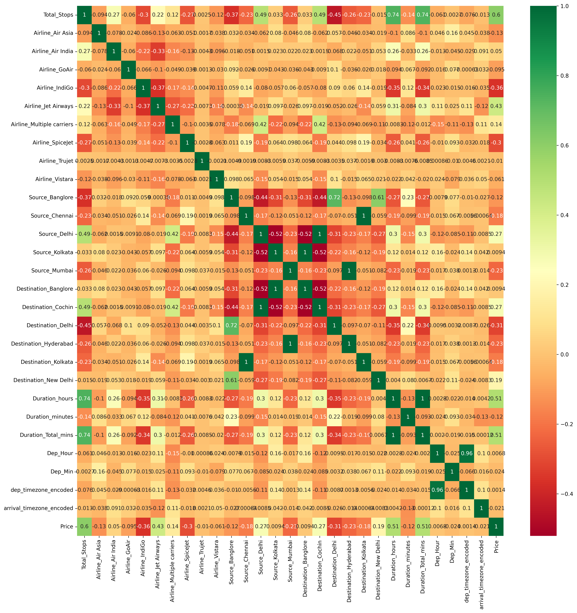
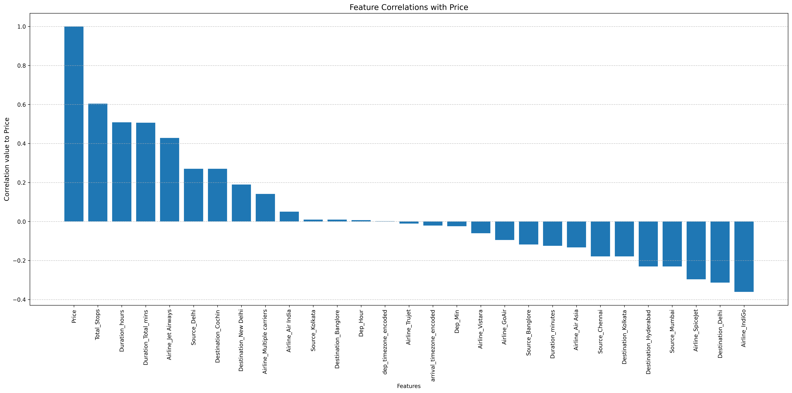
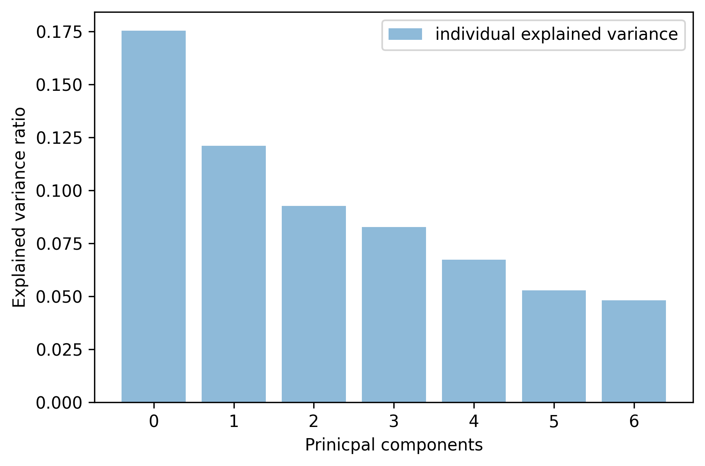

# ibm_ftEngine1
IBM Feature Engineering pt 1

Feature engineering involves: feature transformation (tranforming the original features), feature selection (selecting the most useful features to train on), and feature extraction (combining existing features to produce more useful ones). This project explores these different tools for feature engineering.

Concepts Touched:
- Feature transformation:
    - Dealing with Categorical Variables -> One-Hot Encoding & Label Encoding
    - Date Time Transformation
- Feature Selection
- Feature extraction using Principal Component Analysis

Packages needed are:
- reqeusts for data fetching 
- pandas for managing data
- numpy for math operations
- seaborn for data visualization
- matplotlib for data visualization
- plotly.express for data visualization 
- sklearn for machine learning & machine-learning pipeline related functions

## Findings

Mapped 20+ features and found their correlation to other features. 



Discovered and plotted all features and their correlation to Price. Total number of stops, duration of the flight as well as the Premium airline Jet Airways had positive relationships with ticket price (as each increased, price increased)



After standardizing the data and reducing the number of fields to 7 components, graphed how much variance each component captured from the original data. To readh 95% variance coverage, 16 components were needed. As dimensions decreased, so did variance coverage.

## Set up venv
Create the virtual environment to download needed packages
```bash
    python3 -m venv venv
```
Activate environment:

MAC/Linux
``` 
 source venv/bin/activate 
```
Windows(CMD)
```
    .\venv\Scripts\activate.bat
```
Windows(PowerShell)
```
    .\venv\Scripts\Activate
```

Install packages:
```
    pip isntall pandas seaborn numpy matplotlib scikit-learn requests plotly openpyxl nbformat
```

To ensure that the packages are installed run `pip list` in the terminal with the venv active

**Known issue**:
    Be sure to change the interpreter to the venv corresponding interpreter to recognize the downloaded packages